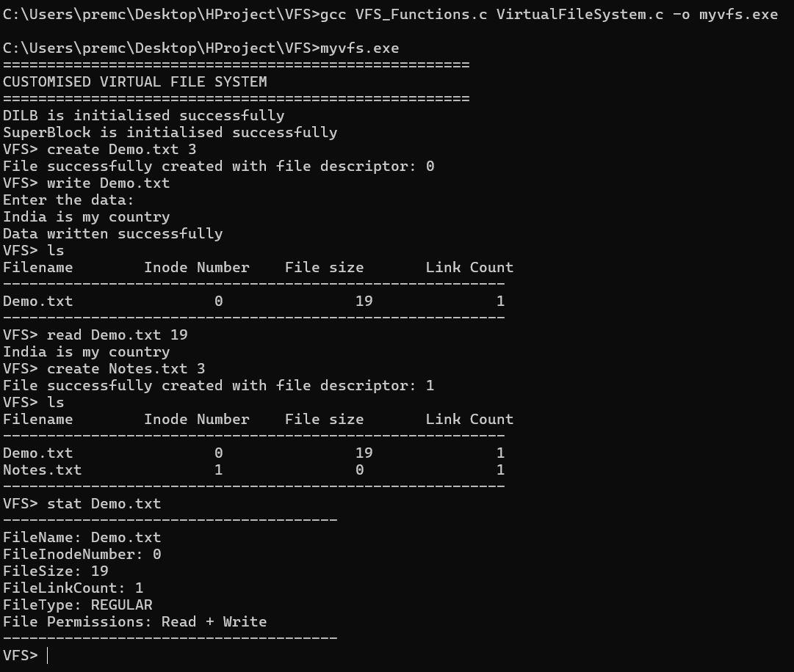

# Virtual File System (VFS) in C

## Project Overview

This project simulates a **Virtual File System (VFS) in C language** that mimics basic UNIX-like file operations such as creating, reading, writing, truncating, and deleting files. It works entirely in memory using custom structures like inodes, file tables, and a user file descriptor table (UFDT).

## Role of the Virtual File System (VFS)

The Virtual File System (VFS) acts as an abstraction layer between user-level programs and various underlying file systems like ext4, FAT32, or NTFS. It provides a consistent set of file operations (such as open, read, write, and close), allowing the operating system to interact with different file systems in a uniform way. This design simplifies file handling, enhances modularity, and enables support for multiple file systems without changing core OS logic.

---
## Tech Stack

This Virtual File System (VFS) project is built using the following technologies and concepts:

| Technology / Concept      | Description                                                                 |
|---------------------------|-----------------------------------------------------------------------------|
| **C Language**            | Core programming language used to implement all logic and memory handling   |
| **GCC Compiler**          | GNU Compiler Collection used to compile and build the project (`.c` files)  |
| **Data Structures**       | Custom structures like **Inode**, **SuperBlock**, **FileTable** and **UFDT** to simulate file system layers |
| **UNIX/Linux Concepts**   | Used as the foundational model to understand real-world VFS behavior         |
| **File System Simulation**| Mimics a real-world file system with support for operations like `read`, `write`, `ls`, etc. |

## How to Compile and Run

### Compilation (Windows/Linux)

```bash
gcc VFS_Functions.c VirtualFileSystem.c -o myvfs.exe
```

### Run the program:

```bash
./myvfs.exe
```

---

### Command List (with Descriptions and Usage)

| Command      | Use Case                                               | Usage Example                         |
|--------------|--------------------------------------------------------|----------------------------------------|
| `ls`         | List the files in the system                           | `ls`                                   |
| `closeall`   | Close all the open files                               | `closeall`                             |
| `cls`        | Clear the console                                      | `cls`                                  |
| `exit`       | Terminate the filesystem application                   | `exit`                                 |
| `stat`       | Display info of a file using filename                  | `stat <filename>`                      |
| `fstat`      | Display info of a file using file descriptor           | `fstat <fd>`                           |
| `rm`         | Remove/delete a file                                   | `rm <filename>`                        |
| `man`        | Display manual/help for a command                      | `man <command>`                        |
| `write`      | Write content to an existing file                      | `write <filename> <data>`                    |
| `truncate`   | Remove all data from a file                            | `truncate <filename>`                  |
| `create`     | Create a new file with permission                      | `create <filename> <permission>`       |
| `open`       | Open an existing file with a mode                      | `open <filename> <mode>`               |
| `read`       | Read data from a file                                  | `read <filename> <size>`                     |
| `offset`     | Get read and write offsets of a file                   | `offset <filename>`                    |


## Internal Architecture

| Component   | Description |
|-------------|-------------|
| **SuperBlock** | Tracks total and free inodes |
| **Inode**      | Represents each file (filename, size, type, etc.) |
| **FileTable**  | Tracks opened file, offsets, and access mode |
| **UFDT**       | Array of pointers to FileTable (file descriptor mapping) |

---

## File Structure

- `SuperBlock`: Global state for inode tracking.
- `Inode`: One per file; implemented as a linked list.
- `FileTable`: Created on file open; tracks read/write positions.
- `UFDT`: Simulated user file descriptor table.

---

## Screenshots

 **The Command-Line Interface**


---

## Author

This project is built to simulate real-world file system concepts using C.  
Developed and maintained by **Prem Choudhary**.

Feel free to enhance it further with:
- Directory support
- Persistent storage (save/load filesystem to disk)
- Command history or shell script support
- Increase the `MAXFILESIZE` to support larger file content

---

## License

This project is licensed under the [MIT License](LICENSE).

